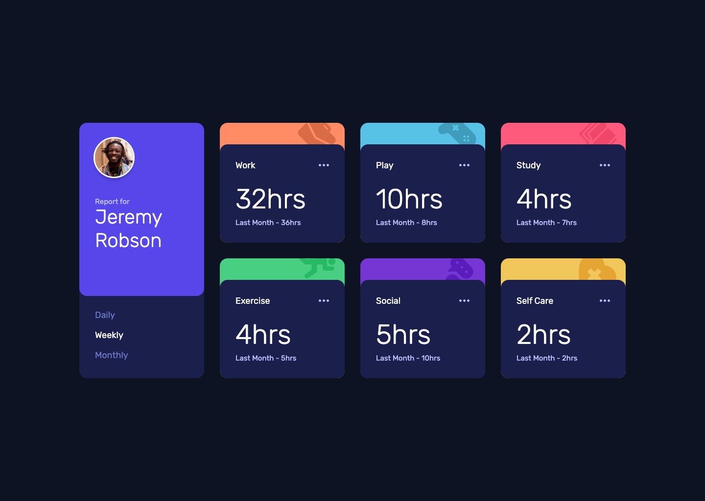

# Frontend Mentor - Time tracking dashboard solution

This is a solution to the [Time tracking dashboard challenge on Frontend Mentor](https://www.frontendmentor.io/challenges/time-tracking-dashboard-UIQ7167Jw). Frontend Mentor challenges help you improve your coding skills by building realistic projects.

## Table of contents

- [Overview](#overview)
  - [The challenge](#the-challenge)
  - [Screenshot](#screenshot)
  - [Links](#links)
- [My process](#my-process)
  - [Built with](#built-with)
  - [What I learned](#what-i-learned)
  - [Continued development](#continued-development)
  - [Useful resources](#useful-resources)
- [Author](#author)

## Overview

### The challenge

Users should be able to:

- View the optimal layout for the site depending on their device's screen size
- See hover states for all interactive elements on the page
- Switch between viewing Daily, Weekly, and Monthly stats

### Screenshot



### Links

- Solution URL: [GitHub](https://github.com/bulhakovolexii/time-tracking-dashboard)
- Live Site URL: [GitHub Pages](https://bulhakovolexii.github.io/time-tracking-dashboard)

## My process

### Built with

- Semantic HTML5 markup
- Flexbox
- Mobile-first workflow
- [Tailwind CSS](https://tailwindcss.com/)
- [Typescript](https://www.typescriptlang.org/)
- [Vite](https://vite.dev/)

### What I learned

I wanted to find a way to update content inside components **without triggering a full re-render**, and I managed to achieve that.

My approach involved using the dataset property of HTML elements to inject dynamic text content directly — which allowed me to keep DOM structure stable and only update the relevant text.

```ts
const currentHours = clone.querySelector("[data-current]") as HTMLElement;
      currentHours.dataset.daily =
        String(item.timeframes.daily.current) + "hrs";
      currentHours.dataset.weekly =
        String(item.timeframes.weekly.current) + "hrs";
      currentHours.dataset.monthly =
        String(item.timeframes.monthly.current) + "hrs";
```

One of the more confusing parts was figuring out how to **map each card type to its corresponding background image and color**.

Eventually, I realized that a simple `Record<string, object>` map with Tailwind class strings did the job cleanly and flexibly.

```ts
const styleMap: Record<string, { bgColor: string; bgImage: string }> = {
  Work: {
    bgColor: "bg-orange-300",
    bgImage: "bg-[url(/images/icon-work.svg)]",
  },
  Play: {
    bgColor: "bg-blue-300",
    bgImage: "bg-[url(/images/icon-play.svg)]",
  },
  Study: {
    bgColor: "bg-pink-400",
    bgImage: "bg-[url(/images/icon-study.svg)]",
  },
  Exercise: {
    bgColor: "bg-green-400",
    bgImage: "bg-[url(/images/icon-exercise.svg)]",
  },
  Social: {
    bgColor: "bg-purple-700",
    bgImage: "bg-[url(/images/icon-social.svg)]",
  },
  "Self Care": {
    bgColor: "bg-yellow-400",
    bgImage: "bg-[url(/images/icon-self-care.svg)]",
  },
};
```

### Continued development

I’d be curious to learn if there’s a more efficient or idiomatic approach to re-rendering content without fully rebuilding the DOM structure.

If there’s a cleaner solution — especially leveraging TypeScript more deeply — I’d be very interested in seeing how it could be implemented.

### Useful resources

[Tailwind CSS Installation with Vite](https://tailwindcss.com/docs/installation/using-vite) – Official guide for setting up Tailwind CSS in a Vite project, providing the most efficient and modern development workflow.  
[Vite Official Website](https://vite.dev/) – Official documentation and resources for Vite, a fast build tool and development server.

## Author

- GitHub - [@bulhakovolexii](https://github.com/bulhakovolexii)
- Frontend Mentor - [@bulhakovolexii](https://www.frontendmentor.io/profile/bulhakovolexii)
- LinkedIn - [@bulhakovolexii](https://www.linkedin.com/in/bulhakovolexii/)
